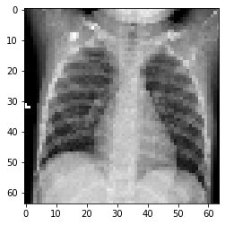
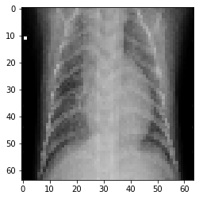
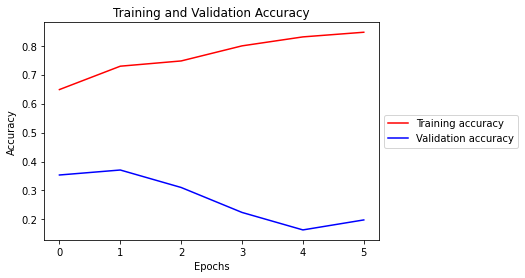
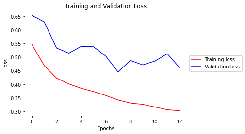
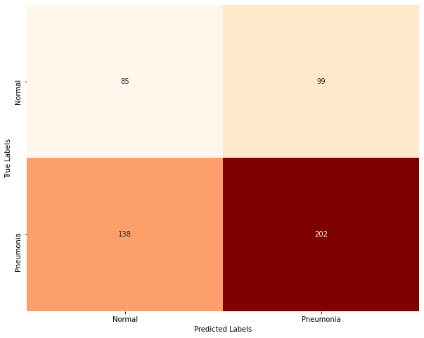

# Identifying Pneumonia with Deep Learning

**Author**: Andre Layton  
GitHub: @therookiescientist-andre

## Overview

  Artificial Intelligence has grown at a rapid rate in recent years, and has begun to creep into a myriad of industries for various uses. One such use is in medical imaging. Classification tasks are common in medical image analysis; it involves classifying medical images, such as X-rays, MRI scans, and CT scans, into different categories based on factors, like the type of image or the presence of specific structures/diseases. The aim is to use algorithms to classify medical images for assistance in diagnosis, treatment planning, and disease monitoring. The issue becomes how to correctly, or accurately, classify images - which is where deep learning models and neural networks come in handy.

## Business Problem

  Physicians and imaging labs are always looking for assistance in diagnosing illnesses, in order to improve treatment planning and health monitoring. The business objective is to build an algorithm that will accurately classify X-ray images (specifically chest images in this project) between two classes ("NORMAL" and "PNEUMONIA"). 

***
## Data & Methods

  The dataset comes from Kermany, Goldbaum et al.; and it is also available via Kaggle. The dataset is pre-split into training, testing, and validation directories, which makes loading and manipulating the data simple for my study. The data is also prepared in a way that makes it perfect for deep learning analysis (i.e. structured data with dimensions that don't require heavy processing). There are 5,216 images in the training directory (split into "NORMAL" and "PNEUMONIA" sub-directories), as well as 624 testing images and 16 validation images, both of which are split similarly to the training directory. I increased my validation dataset by splitting the testing data in order to train the model more effectively - this would have been tough with only 16 images.
  
                                             

  Above are a couple examples of the images that I trained on. Once the data was loaded, I reshaped and standardized the training and validation images to prepare for modeling. I also reshaped their corresponding labels.
  
***
## Modeling

  The best model at identifying and classifying X-ray images of pneumonia-infected patients is the Convolutional Neural Network (CNN) model. The model utilized data augmentation, and early stopping conditions in order to effectively train on the data and avoid any overfitting. As shown in the visual below, as the number of epochs increases, the accuracy of both the training and validation datasets increase, while their loss is minimized as the number of epochs grows. 
  


  The augmented CNN model yielded the best validation accuracy, while also remaining close enough to the training data's score that it avoided obvious overfitting. Luckily, the model was saved using the ModelCheckpoint technique, which was then applied to the testing images for evaluation. The model yielded 84.5% accuracy after testing 524 testing images, and exhibited the smallest margin of loss (shown in the plot below).
  


  The next visual is a confusion matrix of the model on the test data, which shows how effective the model is at identifying pneumonia patients. However, the false negative count is still high, leaving room for further analysis. 



***
## Results & Conclusions

This analysis leads to the following conclusions:

   1. The Convolutional Neural Network (CNN) model performs the best in image classification; specifically, when the data has been augmented.

   2. The model is 84.5% accurate when testing and classifying chest X-ray images for pneumonia.

This project is limited in a few ways, the first being the lack of data. It wasn't until I augmented my data that the model began to train better, and yield efficient results. If given more image data, the model could effectively learn more of the abstract features within the X-ray images to better identify between the two groups of patients. In addition, the computer I'm running my model on lacks the strength to iterate the model with more epochs. If I were to increase my epochs, or even add additional layers to my model, I could potentially improve my results. There are other hyperparameters I could test, as well, which might also improve the algorithm's performance.

Further analyses could yield a more effective classifier, and possibly improve the algorithm's performance. Some possible courses of action I could take include training with other pre-trained networks. The research I found led me to pre-select a base model; however, I could train a few more that may examine the training images better, and improve my results. In addition, I could increase my validation data further, which would reduce the amount of "noise" shown in my visuals for the validation data's metrics, but also give me a better idea on how to further develop my classifier.

***
## Repository Contents
Below is a list of the contents of this repository.

```
├── README.md             
├── images   
├── .gitignore
├── best_aug_model.h5
├── validation_data_preparation.ipynb                              
├── notebook.ipynb
├── presentation.pdf                                
├── notebook.pdf                                
└── github.pdf
