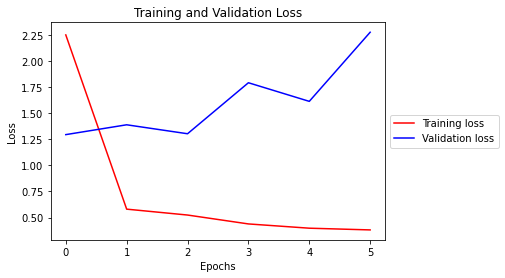
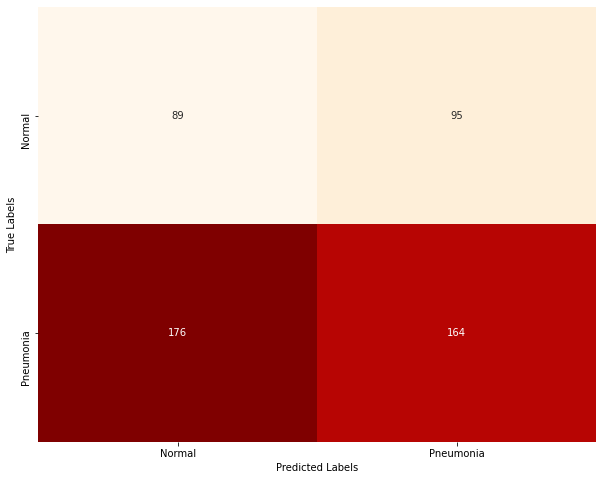

# Identifying Pneumonia with Deep Learning

**Author**: Andre Layton  
GitHub: @therookiescientist-andre

## Overview

  Artificial Intelligence has grown at a rapid rate in recent years, and has begun to creep into a myriad of industries for various uses. One such use is in medical imaging. Classification tasks are common in medical image analysis; it involves classifying medical images, such as X-rays, MRI scans, and CT scans, into different categories based on factors, like the type of image or the presence of specific structures/diseases. The aim is to use algorithms to classify medical images for assistance in diagnosis, treatment planning, and disease monitoring. The issue becomes how to correctly, or accurately, classify images - which is where deep learning models and neural networks come in handy.

## Business Problem
  Hospital executives approved the development of a radiology department, as part of their initiative for expansion. The goal is to cut costs on outsourcing tasks by creating in-house units - starting with radiology. In an effort to streamline diagnostic testing, I'm tasked with building a classifier that will accurately analyze X-ray images, which will allow their physicians to put more focus on interventional planning and patient treatment.

  This project's objective is to build an algorithm that will accurately classify X-ray images (specifically chest images) between two classes ("NORMAL" and "PNEUMONIA"). I'll be using data, available on Kaggle, that was gathered by Kermany, Goldbaum et al., and a link can be found at the bottom of the main notebook ('notebook.ipynb').
  
***
## Data & Methods

  The dataset comes from Kermany, Goldbaum et al.; and it is also available via Kaggle. The dataset is pre-split into training, testing, and validation directories, which makes loading and manipulating the data simple for my study. The data is also prepared in a way that makes it perfect for deep learning analysis (i.e. structured data with dimensions that don't require heavy processing). There are 5,216 images in the training directory (split into "NORMAL" and "PNEUMONIA" sub-directories), as well as 624 testing images and 16 validation images, both of which are split similarly to the training directory. I increased my validation dataset by splitting the testing data in order to train the model more effectively - this would have been tough with only 16 images. 
  
  NOTE: Run the 'validation_data_preparation.ipynb' notebook prior to running the main notebook in order to reproduce my analysis.
  
                                        

  Above are a couple examples of the images that I trained on. Once the data was loaded, I reshaped and standardized the training and validation images to prepare for modeling. I also reshaped their corresponding labels.
  
***
## Modeling

  The best model at identifying and classifying X-ray images of pneumonia-infected patients is the Convolutional Neural Network (CNN) model. The model utilized data augmentation, and early stopping conditions in order to effectively train on the data and avoid any overfitting. As shown in the visual below, the training data's accuracy grows, but the validation data's accuracy varies within the 6 epochs the model ran for (before triggering the stopping condition).
  


  The augmented CNN model yielded the best validation accuracy, while also remaining close enough to the training data's score that it avoided obvious overfitting. Luckily, the model was saved using the ModelCheckpoint technique, which was then applied to the testing images for evaluation. The model's stopping condition was based on the validation data's loss and its growth/decline rate (as shown below).
  


  The model yielded 40.3% accuracy after testing 524 testing images. The next visual is a confusion matrix of the model on the test data, which shows how effective the model is at identifying pneumonia patients. However, the false negative count is still high, leaving room for further analysis. 



***
## Results & Conclusions

This analysis leads to the following conclusions:

   1. The Convolutional Neural Network (CNN) model performs the best in image classification; specifically, when the data has been augmented.

   2. The model is 40.3% accurate when testing and classifying chest X-ray images for pneumonia.

This project is limited in a few ways, the first being the lack of data. It wasn't until I augmented my data that the model began to train better, and yield efficient results. If given more image data, the model could effectively learn more of the abstract features within the X-ray images to better identify between the two groups of patients. Also, training the models with a more balanced class distribution so that I can tackle the issue of false negatives. In addition, computational constraints limit my ability to iterate the model with more epochs. If I were to increase my epochs, or even add more GPUs for modeling, I could potentially improve my results. There are other hyperparameters I could test, as well, which might also improve the algorithm's performance.

Further analyses could yield a more effective classifier, and possibly improve the algorithm's performance. Some possible courses of action I could take include training with other pre-trained networks. The research I found led me to pre-select a base model; however, I could train a few more that may examine the training images better, and improve my results. In addition, I could balance my class distribution better, which would reduce the amount of "noise" shown in my visuals for the validation data's metrics, but also give me a better idea on how to further develop my classifier.

***
## Links
For those that would like to reproduce my analysis, or begin their own, here is a link to the original dataset by Kermany, Goldbaum et al.:
https://www.kaggle.com/datasets/paultimothymooney/chest-xray-pneumonia

***
## Repository Contents
Below is a list of the contents of this repository.

```
├── README.md             
├── images   
├── .gitignore
├── best_aug_model.h5
├── validation_data_preparation.ipynb                              
├── notebook.ipynb
├── presentation.pdf                                
├── notebook.pdf                                
└── github.pdf
